# Sprite Library Asset
A Sprite Library Asset groups multiple Sprites into [Categories](#Categories) and unique [Label](#Labels) names. It is used in combination with the [Sprite Library](#sprite-library-component) component and [Sprite Resolver](#sprite-resolver-component) component to swap Sprite graphics at runtime.

To create the Asset, go to __Assets__ > __Create__ > **2D** > __Sprite Library Asset__.

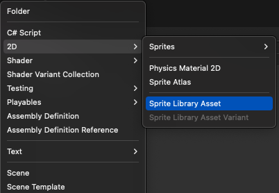

To create the Asset variant that inherits Categories and Labels from a selected Sprite Library Asset, first select the main asset in the Project window, then go to __Assets__ > __Create__ > **2D** > __Sprite Library Asset Variant__.

## Sprite Library Asset Inspector window
Once the Sprite Library Asset is created, select the Asset and go to its Inspector window.

 Sprite Library Asset Inspector properties

Property  |Function
--|--
**Open in Sprite Library Editor**  |   Select this button to open a [Sprite Library Editor window](#Sprite-Library-Editor-window) where the content of the Asset can be edited.
**Main Library**  |  Assign another Sprite Library Asset here to make it the main reference for the current Sprite Library Asset. The current Sprite Library Asset becomes a variant of the [Main Library](#main-library), which allows it to access the **Main Library**'s Categories and Entries.
**Revert**  |  This resets changes in the Inspector back to the last saved state. Unsaved changes are removed.
**Apply**  |  This saves the current value of Main Library in the Sprite Library Asset.

## Sprite Library Editor window
Sprite Library Editor window allows editing the content of the Sprite Library Asset. It can be accessed by __double-clicking__ on the selected Sprite Library Asset in Project window, selecting the __Open in Sprite Library Editor__ button in the [Inspector](#Sprite-Library-Asset-Inspector-window), or by selecting it from menu __Window__ > **2D** > __Sprite Library Editor__.

### Categories
A Category contains selected Labels that have been grouped together for a common purpose. Make sure that each Category has a unique name.
To create a new Category, select the '__+__' button, or [drag and drop](#Drag-and-drop) Sprites directly into the Sprite Library Editor window.

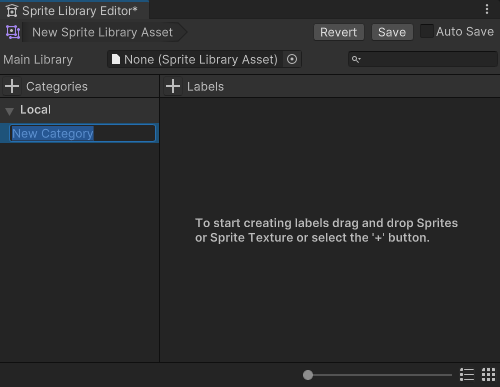 Categories tab with the '__+__' button

The Categories Tab can contain __Local__ and __Inherited__ Categories:
- Local Categories are Categories created in the Sprite Library Asset currently being edited.
- Inherited Categories are retrieved from the [Main Library](#main-library). Inherited categories cannot be renamed to ensure that the Main Library and variant Sprite Library Assets contain Categories with exactly the same name. Any inherited Category can be  overridden by adding new Labels or changing the Sprite reference in a inherited Label.

 Local & Inherited foldout groups in the Categories tab.

### Labels
Each Category can contain many Labels and each Label can reference a single Sprite in the project. To create a new Label, select the '__+__' button, or [drag and drop](#Drag-and-drop) Sprite directly into the Sprite Library Editor window.

Labels tab with the '__+__' button

If the Label exist in the Inherited Category, it cannot be renamed to ensure that the Main Library and Assets that reference that Sprite Library contain the same Categories and Labels. To revert changes in the inherited Category, select the Labels you wish to revert and right-click to open the context menu and select __Revert Selected Overrides__ or __Revert All Overrides__ if you want to make the entire Category the same as it is in the Main Library.

 Changes to Labels in inherited Categories can be reverted in the Labels tab.

Sprite Library Editor window allows Labels to be viewed in a list or in a grid. To toggle between these two, use the buttons at the bottom of the window and use the slider to adjust the size of the Label elements.

### Search for Categories and Labels
Categories and Label tabs can be filtered by the search phrase in the search bar in the top-right side of the window.

[comment]: <> (TODO need screenshot)

### Drag and drop
You can quickly populate Categories and Labels by dragging Sprites or [PSD Importer supported file types](#PreparingArtwork.md) into the Sprite Library Editor window.

1. Create a new Category with one Label for each Sprite

Drag and drop Sprites to an empty space in the Categories tab to create a new Category with one Label for each Sprite in the selection. The Category is be named after the first Sprite in the selection and Labels are named after the Sprite's name. If there are any conflicting name, it will be appended with _X suffix for example ConflictingSpriteName_0.

 Example: Drag and drop multiple Sprites to an empty space in Categories Tab.
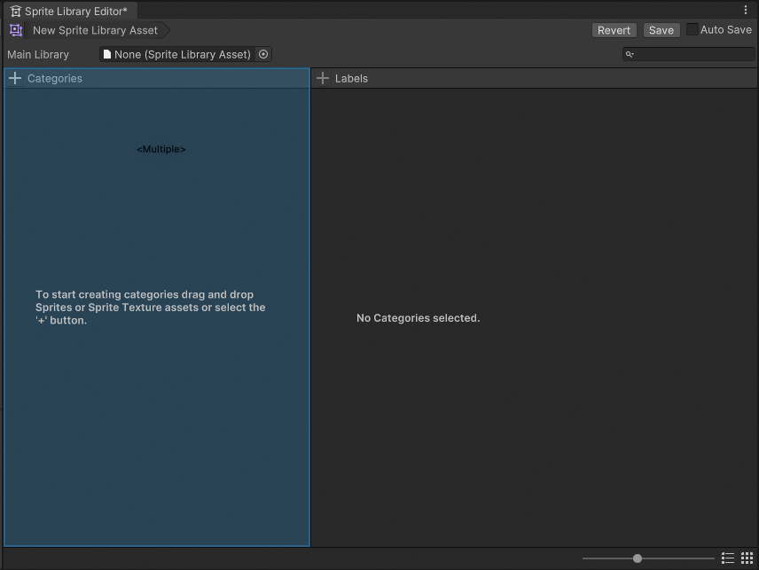

 Result: One Category with Labels for each Sprite in the Selection
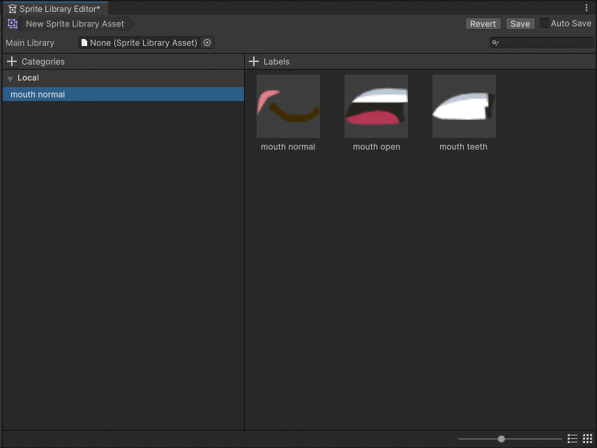

2. Create a new Category for each Layer Group with one Label for each Sprite in a Layer

To create Categories for each Layer Group with Labels that match Layers in that group simply drag and drop [PSD Importer supported file](#PreparingArtwork.md) e.g. .psd or .psb. Make sure that __Use Layer Group__ is checked.

 Result: One Category for each Layer Group and Labels for each Layer.
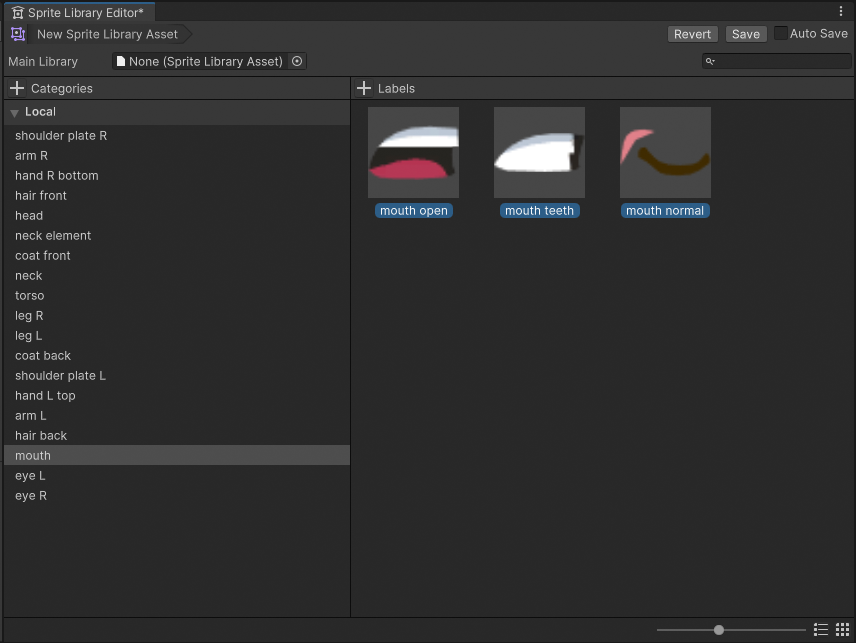

To replace each Label's Sprite reference with Sprites from a different file, simply drag and drop it to an empty space in the Categories Tab.

 Result: Each Label's Sprite reference is replaced.
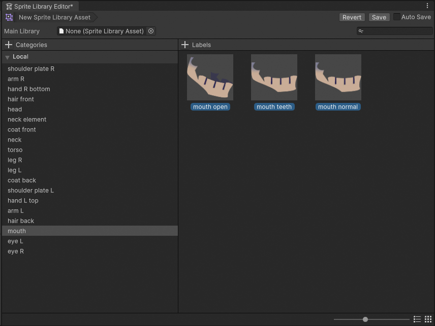

3. Replace each Label's Sprite in the Category

Drag and drop Sprites to an existing Category. For each Sprite in the selection, a new Label with the same name will be created. If a Label with the same name already exists, its Sprite reference will be replaced with the first Sprite from the selection.

 Example: Category with several Labels.
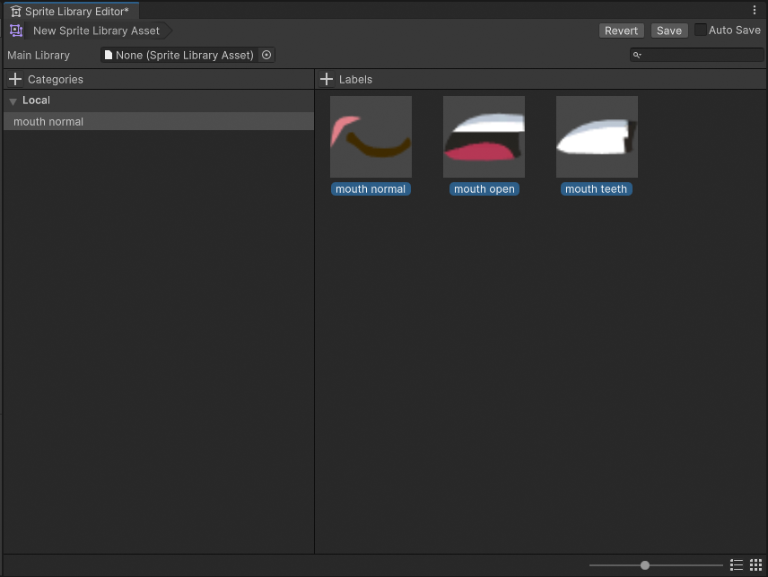

 Result: Labels are replaced after drag and drop.
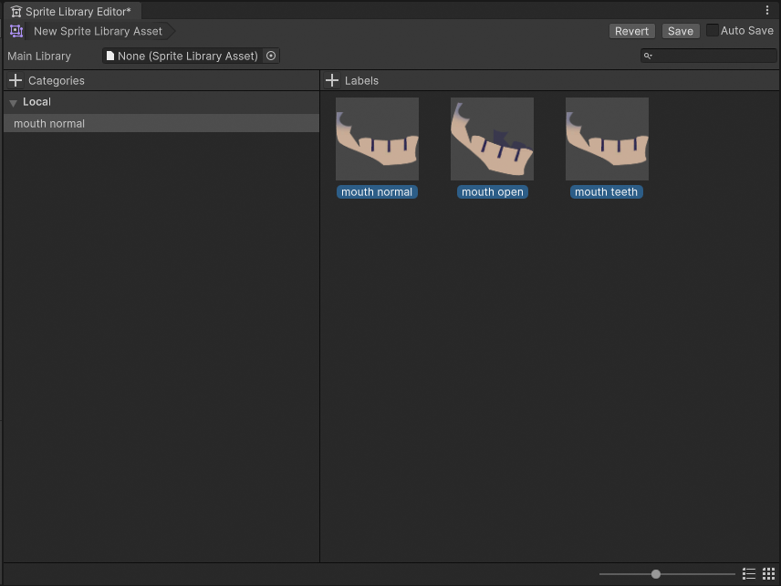

4. Create a new Label for each Sprite in the Category

Drag and drop Sprites to an empty space in the Labels tab. For each Sprite in the selection, a new Label with the same name will be created. If a Label with the same name already exists the _X suffix will be added to the newest Label.

 Example: Category with before dragging and dropping Sprites.
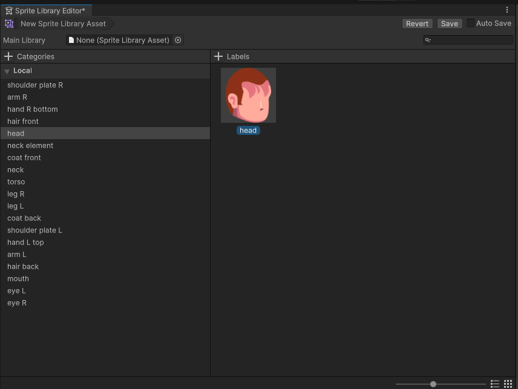

 Result: Additional Cateories created with suffix _0, _1 etc.

5. Replace a Label's Sprite

Drag and drop a Sprite to an existing Label.

 Example: Drag and drop a Sprite on a Label.
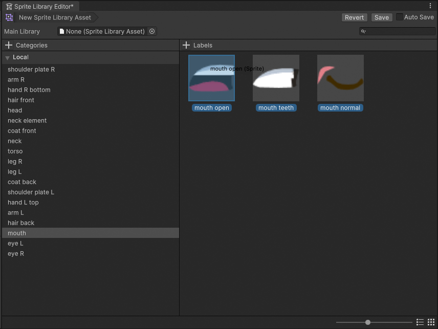

 Result: Label's Sprite reference is replaced with the first Sprite in the selection.

## Main Library
Assigning another existing Sprite Library Asset to the **Main Library** property of the current Sprite Library Asset allows the current Asset to access all Categories and Labels contained in the assigned Sprite Library Asset. Categories retrieved from the Main Library Asset are grouped under the **Inherited** foldout group, and all new Categories that exist only in the current Asset are grouped under the **Local** foldout group.

The Labels of the Categories retrieved from the Main Library property can't be renamed or removed. However, you can add new Labels to a Category which was retrieved from the Sprite Library Asset assigned to the **Main Library** property.

You can also edit a Label to change the Sprite that it refers to by selecting the object picker and choosing a different Sprite. It's also possible to [drag and drop](#Drag-and-drop) a Sprite to a Label to change its Sprite. To revert changes to a Sprite, select the Label, right-click and select **Revert Selected Overrides** to restore it to the original Sprite that was retrieved from the Main Library.

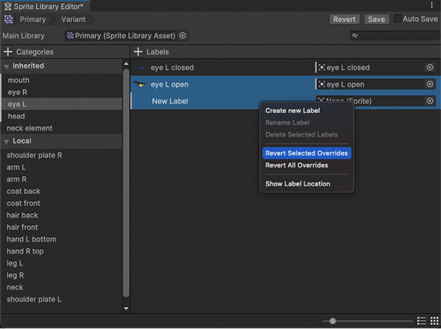

Use Sprite Library Editor **breadcrumbs** to navigate between between different Sprite Library Assets that the edited Asset inherits from. After clicking on an Asset in the breadcrums it will be selected in the Project window.

## Sprite Library component

The [Sprite Library component](SL-component.md) defines which Sprite Library Asset a GameObject refers to at runtime. Attach this component to a GameObject or any parent GameObject of a Sprite Resolver component to allow the [Sprite Resolver](#sprite-resolver-component) to change the Sprite that is being used by a [Sprite Renderer](https://docs.unity3d.com/Manual/class-SpriteRenderer).

In the Sprite Library component’s Inspector window, assign the desired Sprite Library Asset to the **Sprite Library Asset** property. Alternatively, select the **New** button to create and save a new Sprite Library Asset which is automatically assigned to the Sprite Library Asset field.

## Sprite Resolver component
The Sprite Resolver component is attached to each GameObject in the Prefab. The component pulls information from the [Sprite Library Asset](SL-Asset.md) (assigned to the [Sprite Library component](SL-component.md) at the root of the Prefab). The component contains two properties - [Category](#category) and [Label](#entry) - and a visual Variant Selector that displays thumbnails of the Sprites contained in the Sprite Library Asset.

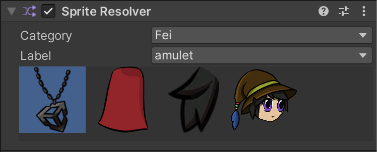 Inspector view of Sprite Resolver component.

| Property     | Function                                                     |
| ------------ | ------------------------------------------------------------ |
| __Category__ | Select which Category you want to use a Sprite from for this GameObject. |
| __Label__    | Select the Label of the Sprite you want to use for this GameObject. |
|(Visual variant selector)   |Displays selectable thumbnails of the Sprites contained in this Category.   |

Select the Sprite you want the **Sprite Renderer** to render by selecting from the **Category** and **Label** dropdown menus, or select the Sprite directly in the visual variant selector.
