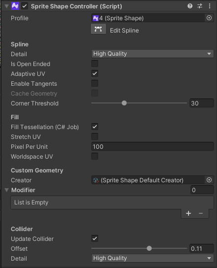
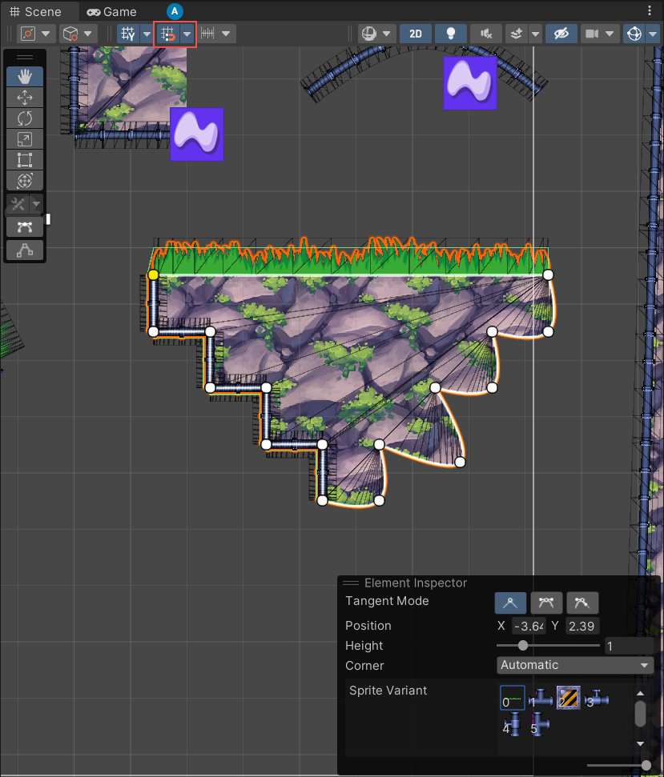
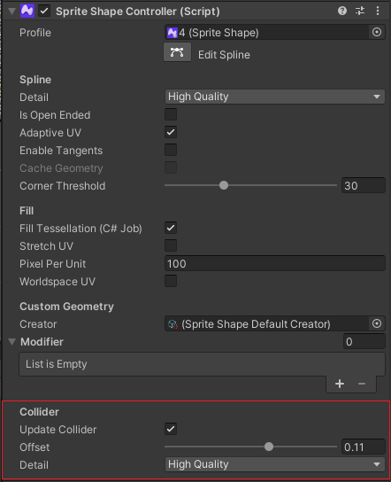
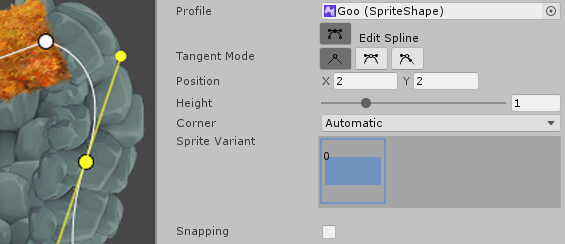
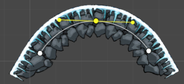

# Sprite Shape Controller

The __Sprite Shape Controller__ component is automatically attached to the GameObject created when a [Sprite Shape Profile](SSProfile.md) is dragged into the Scene. You edit the shape of the Sprite Shape's outline through the Controller's settings. The Controller displays different settings depending on different conditions.

## Property Settings - Default

The default component settings below are displayed when Edit Spline is not enabled.

| __Property__                                                 | __Function__                                                 |
| ------------------------------------------------------------ | ------------------------------------------------------------ |
| __Profile__                                                  | Select the __Sprite Shape Profile__ used by this Sprite Shape. |
| __Edit Spline__                                              | Enable  to make the Control Points of the Sprite Shape visible and editable. |
| __Spline__                                                   | -                                                            |
| __Detail__                                                   | Select the tessellation quality of the rendered Sprite Shape mesh. High/Medium/Low Quality options available. |
| __Open Ended__                                               | Disable to connect both ends of the Sprite Shape together to form an enclosed Shape. Enable to leave both ends of the Sprite Shape unconnected. |
| __Adaptive UV__                                              | Enabled by default. When enabled, Unity attempts to seamlessly tile the Sprites along the Sprite Shape path by deforming the Sprites to between Control Points. Disable this property to tile Sprites with no deformation and at  their exact width. Sprites may appear cutoff if the space between Control Points is shorter than the width of the Sprite. |
| __Enable Tangents__                                          | Enable this property if there are features which require tangent calculations, such as when utilizing the Shaders with the [2D Universal Render Pipeline](https://docs.unity3d.com/Packages/com.unity.render-pipelines.universal@9.0/manual/2d-index.html). |
| __Corner Threshold__                                         | Use this slider to set the threshold of when a point is considered a corner of the Sprite Shape, where the value is the angle between adjacent edges and angles at the. A point is considered a corner at the threshold value and lower. The default value is 30 degrees. Set a custom value to override this default value. |
| __Fill__                                                     | -                                                            |
| __Fill Tessellation (C# Job)__                               | Generate fill geometry in C# Job.                            |
| __Stretch UV__                                               | Enable this setting to have Unity stretch the UV of the Fill texture across the Full Rect of the Sprite Shape. |
| __Custom Geometry Creator__                                  | Set the Scriptable Object that generates custom geometry. By default a built-in generator is set when created. |
| __Custom Geometry Modifier__                                  | Set a list of Scriptable Objects that modifies generated geometry. |
| __Pixels Per Unit (only available when Stretch UV is disabled)__ | This values affect the appearance of the Fill texture of the Sprite Shape. This value affects the scale of the Fill texture, with higher values reducing the size of the texture. The default value is 100. |
| __World Space UV (only available when Stretch UV is disabled)__ | Enable to apply the Fill texture according to the World Space UV, instead of per GameObject UV. |

### With Edit Spline enabled and a Control Point selected

Enable __Edit Spline__ in the Controller settings to make Control Points on the Sprite Shape visible and editable. Selecting a Control Point enables the following additional Controller settings.

 A: Global snap toggle

| __Point__                                               | -                                                            |
| ------------------------------------------------------- | ------------------------------------------------------------ |
| __Tangent Mode__                                        | Select one of three __Point Modes__ to change the way tangents on Control Points are edited. |
| __Linear__              | No curve is formed between the Control Point and its neighboring points. |
| __Continuous Mirrored__ | Two tangents appear on opposite sides of the Control Point, and the spline between the Control Point and its neighbors becomes curved. Adjust the tangents to change the shape of the curve. The angle between the two tangents is always 180 degrees in this mode. |
| __Broken Mirrored__     | Two tangents appear on opposite sides of the Control Point, and the spline between the Control Point and its neighbors becomes curved. Adjust the tangents to change the shape of the curve. The length and angle of the tangents can be adjusted independently in this mood. |
| __Position__                                            | The local x and y coordinates of a selected Control Point.   |
| __Height__                                              | Increase or decrease the height of Sprites at the Control Point by a factor of 0.1 to 4. |
| __Corner__                                              | Sets whether Corner Sprites are rendered at Control Points. Set to __Automatic__ by default. |
| &nbsp;&nbsp;__Disabled__                                | A Sprite is not rendered at the selected Control Point.      |
| &nbsp;&nbsp; __Automatic__                              | The Control Point displays the assigned Corner Sprite, if both it and its neighbors are in __Linear Point Mode__. |
| &nbsp;&nbsp;__Stretched__                               | The Corner Sprite at the selected Control Point is connected to its adjacent neighbors, stretching the Sprite. See the [list of required criteria](#stretched-corners) below to use this feature. |
| __Sprite Variant__                                      | Select the __Sprite Variant__ from the visual Variant selector. Press __N__ to cycle through all available Variants for the Control Point. |
| __Global snapping__                                             | When [Edit Spline](#editing-the-spline) is enabled, select the **Global Snap** icon (see **A** in screenshot above) to toggle Grid Snapping on or off. |

### Stretched Corners

This feature allows the Sprite Shape to form corners with stretched Sprites between adjacent edges between the corner point and its neighbors. Select the Stretched option from the __Corner__ dropdown menu, and ensure the following criteria are met:

1. Both the selected and adjacent points have the same __Height__.
2. Sprites rendered at the Corner point and its neighboring points must have the same Sprite pivot position.

### Additional Collider settings

Add either the __Polygon Collider 2D__ or __Edge Collider 2D__ component to the __Sprite Shape__ to enable additional __Collider__ settings in the __Sprite Shape Controller__. Refer to [Enabling Collision](SSCollision.md) for more details about enabling Colliders with Sprite Shapes. Colliders are always optimized by cleaning up extra control points that are colinear.

| Collider              | -                                                            |
| --------------------- | ------------------------------------------------------------ |
| __Update Collider__   | Enabled by Default. Enable this option to have the Collider mesh be updated to the Sprite Shape's current shape as the Sprite Shape is edited. Disable if you are editing the Collider mesh separately from the Sprite Shape and to use a custom Collider mesh. |
| __Offset__            | Select the amount to extrude the Collider mesh towards the edge of the Sprite Shape. The range is from -0.5 to 0.5, starting at 0 by default. |
| __Detail__            | Sets the tessellation quality of the rendered Collider. High/Medium/Low Quality options available. |

## Editing the Spline

To edit the mesh outline of the __Sprite Shape__, click the __Edit Spline__ button to make the Shape's spline and its __Control Points__ become visible and editable.

When __Edit Spline__ is enabled, move the Control Points of the Sprite Shape to adjust its overall shape and size. Add additional Control Points by clicking on the spline in between Control Points. Press the __Del/Delete__ key to remove the currently selected Control Point.

With a Control Point selected, cycle through the __Point Modes __by pressing the __M__ key. To change the __Mode__ of multiple Control Points at once, ensure that all selected Control Points are the same __Mode__ first before cycling or selecting another __Mode__.

To change the Sprite Variant currently displayed at a selected Control Point, press the __N__ key to cycle through all available Variants.

All shortcut keys can be rebound under the Shortcut menu (menu: __Edit > Shortcuts... > SpriteShape Editing__).

## Point Modes

When a Control Point is selected, its __Point Mode__ can be one of three modes- __Linear__, __Mirrored__, and __Non-Mirrored__.

The __Point Mode__ determines the behavior of the tangents that are used to adjust the spline between Control Points. Each Control Point can be set to a specific Point Mode and contain its own settings.

### Linear Point Mode

In __Linear Point Mode__, there are no tangents to control the curve between the Control Point and its neighbors, curves are not formed between Control Points and Sprites may overlap if they intersect.

Adjust which Sprite is displayed when two or more intersect by adjusting their __Order__ value in the [Sprite Shape Profile's](SSProfile.md) __Angle Range__ settings.

### Continuous Mirrored Point Mode

In __Continuous Mirrored Point Mode__, tangents appear on both sides of the selected Control Point to create a curve between the Control Point and its neighbors. Adjust the shape of the curve with the tangents. In this mode, the angle between the tangents is always maintained at 180 degrees although their lengths from the can vary.

Press __B__ to mirror the length of the last edited tangent onto the opposite tangent.

### Broken Mirrored Point Mode

In __Broken Mirrored Point Mode__,  tangents appear on both sides of the selected Control Point to create a curve between the Control Point and its neighbors. Adjust the shape of the curve with the tangents. In this mode, the length and angle of each tangent can be adjusted independently.

Press __B__ to mirror the length of the last edited tangent onto the opposite tangent. In this mode, pressing __B__ also causes the angle of the opposite tangent to become exactly 180 degrees from the last edited tangent.

