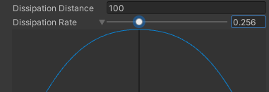
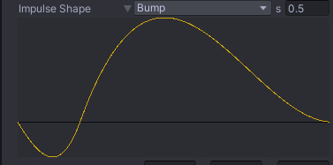
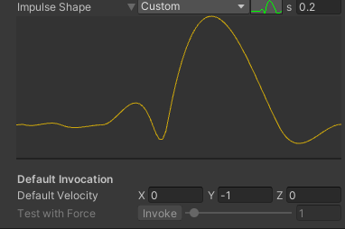

# Cinemachine Impulse Source

Use the **Cinemachine Impulse Source** component to generate impulses on events that are not collisions or Collider triggers. This is a generic Impulse Source that exposes a family of `GenerateImpulse()` API methods. These methods generate impulses at the specified locations and with the specified velocities and strengths. Call these methods directly from your game logic, or use them with [UnityEvents](https://docs.unity3d.com/Manual/UnityEvents.html). 

>**TIP:** You can use the script for this component as an example to reference when creating your own custom impulse-generating classes.

To add a Cinemachine Impulse Source to your Scene:

1. Select the GameObject that you want to trigger camera shake, navigate to its Inspector, and click the **Add Component** button.

2. Go to **Scripts > Cinemachine**, and select **Cinemachine Impulse Source**.

By default, an Impulse Source affects every [Impulse Listener](CinemachineImpulseListener.md) in range, but you can apply [channel filtering](CinemachineImpulseFiltering.md#ChannelFiltering) to make Impulse Sources affect some Impulse Listeners and not others. 

##Properties:

The properties in the Cinemachine Impulse Source Inspector window are divided into the following sections.

- [Impulse Channel](#ImpulseChannel)
- [Impulse Type](#ImpulseType)
- [Impulse Shape](#ImpulseShape)

### Impulse Channel

Impulse Listeners filter impulses based on channels to control which Impulse Sources they react to. Channels work like Camera Layers, but are distinct from them. These properties control the channels that the Impulse Source broadcasts impulse signals on. For details, see documentation on [Filtering](CinemachineImpulseFiltering.md).

| **Property:**       | **Function:**                                                |
| ------------------- | ------------------------------------------------------------ |
| **Impulse Channel** | Choose one or more channels from the drop-down.  Click **Edit** to modify existing channels or add new ones. |

### Impulse Type

 You can choose the level of complexity, depending on your needs. Changing the Impulse Type brings up range, dissipation, and propagation speed controls, as appropriate. 

| Property:| Function:|
|--|--|
|**Impulse Type**|You can choose from the following Impulse types:  **Uniform**: The impulse travels with infinite speed, and will be heard at the same time and in the same way by all listeners, no matter where they are in space.  **Dissipating**: The strength of the impulse decreases as the distance from the source increases. Listeners that are farther away will feel a weaker signal than listeners that are closer.  **Propagating**: In addition to being dissipating, the impulse signal travels with finite speed outward from the source.  Listeners that are farther away will feel the impulse at a later time than listeners that are close.    **Legacy**: This mode exists to support projects made with earlier versions of Impulse, and has a more complex way of defining the impulse signal. We recommend using one of the other settings.|
|**Dissipation Distance**|This setting defines the distance over which the impulse dissipates. Beyond this distance, the impulse will not be felt.|
|**Propagation Speed**| This defines, in m/s, how quickly the impulse signal propagates outwards through space from its origin. The default value, 343, is the speed of sound.|
|**Dissipation Rate**|This defines how quickly the dissipation occurs over the dissipation distance. As shown in the image below, expanding the curve shows a graph illustrating the signal strength across the dissipation radius. The origin is in the center of the X axis. Moving the slider adjusts the blue picture.  |

### Impulse Shape

This defines the curve that specifies the shape of the signal, and the time over which the curve is emitted.

| Property:| Function:|
|--|--|
|**Predefined Impulse Shape**|You can choose from one of the following predefined Shapes: **Recoil**, **Bump**, **Explosion**, or **Rumble**.   **s (seconds)** field: Sets the duration of the impulse. Opening up the property shows you a picture of the impulse:  |
|**Custom Impulse Shape**|You can draw your own custom impulse shape (animation curve). Select **Custom** from the drop-down menu and click on the green icon to pop up an editor as shown below.  |
|**Default Velocity**|Specifies the direction in space that the impulse will have by default.|
|**Test with Force**| Allows you to **invoke** the default impulse from the inspector (when playing) with the specified force multiplier, to see what it looks like.|
