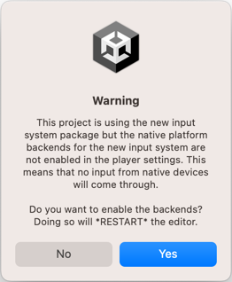
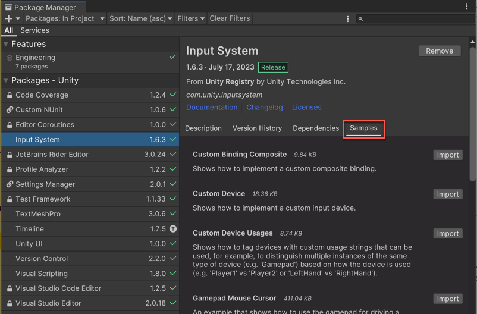

# Installation guide

- [Installation guide](#installation-guide)
  - [Installing the package](#installing-the-package)
  - [Enabling the new input backends](#enabling-the-new-input-backends)
  - [Installing samples](#installing-samples)

This guide describes how to install and activate the Input System package for your Unity Project.

>__Note__: The new Input System requires Unity 2019.4+ and the .NET 4 runtime. It doesn't work in projects using the old .NET 3.5 runtime.

## Installing the package

To install the new Input System, open Unity's package manager (menu: __Window > Package Manager__). Select the __Input System__ package from the list, then click __Install__.

## Enabling the new input backends

By default, Unity's classic Input Manager (`UnityEngine.Input`) is active, and support for the new Input System is inactive. This allows existing Unity Projects to keep working as they are.

When you install the Input System package, Unity will ask whether you want to enable the new backends. Click **Yes** to enable the new backends and disable the old backends. The Editor restarts during this process.

You can find the corresponding setting in __Edit__ > __Project Settings__ > __Player__ > __Other Settings__ > __Active Input Handling__. If you change this setting you must restart the Editor for it to take effect.

>**Note:** You can enable __both__ the old __and__ the new system at the same time. To do so, set **Active Input Handling** to **Both**.

When the new input backends are enabled, the `ENABLE_INPUT_SYSTEM=1` C# `#define` is added to builds. Similarly, when the old input backends are enabled, the `ENABLE_LEGACY_INPUT_MANAGER=1` C# `#define` is added. Because both can be enabled at the same time, it is possible for __both__ defines to be 1 at the same time.

## Installing samples

The Input System package comes with a number of samples. You can install these directly from the Package Manager window in Unity (__Window > Package Manager__). To see the list of samples, select the Input System package in the Package Manager window and click the __Samples__ tab. Then click __Import__ next to any sample name to import it into the current Project.

For a more comprehensive demo project for the Input System, see the [InputSystem_Warriors](https://github.com/UnityTechnologies/InputSystem_Warriors) GitHub repository.
