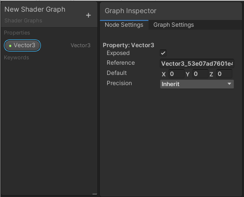
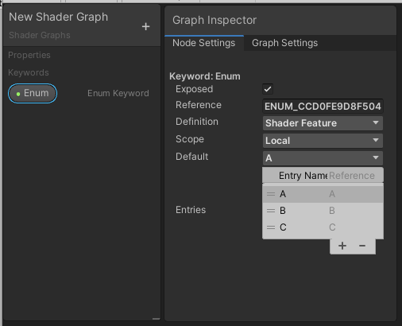
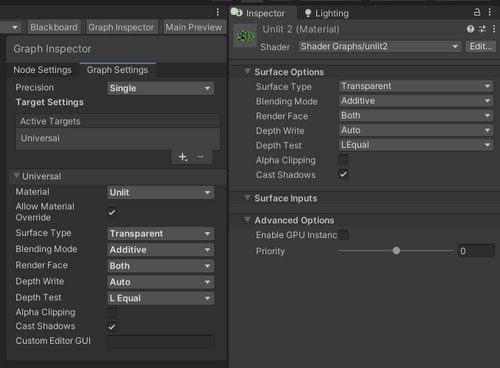
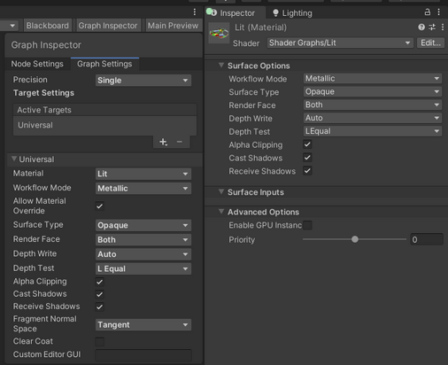

# Graph Inspector

## Description

The **Graph Inspector** makes it possible for you to interact with any selectable graph elements and graph-wide settings for a [Shader Graph Asset](Shader-Graph-Asset.md). You can use the **Graph Inspector** to edit attributes and default values.

When you open a Shader Graph, the **Graph Inspector** displays the **[Graph Settings](Graph-Settings-Menu.md)** tab by default. Graph-wide settings for that specific Shader Graph appear in this tab.

## How to use

Select a node in the graph to display settings available for that node in the **Graph Inspector**. Settings available for that node appear in the **Node Settings** tab of the Graph Inspector. For example, if you select a Property node either in the graph or the [Blackboard](Blackboard.md), the **Node Settings** tab displays attributes of the Property that you can edit.

Graph elements that currently work with the Graph Inspector:

- [Properties](https://docs.unity3d.com/Manual/SL-Properties.html)

    

- [Keywords](Keywords.md)

    

- [Custom Function nodes](Custom-Function-Node.md)

    

- [Subgraph Output nodes](Sub-graph.md)

    

- [Per-node precision](Precision-Types.md)

    

Graph elements that currently do not work with the Graph Inspector:

- Edges
- [Sticky Notes](Sticky-Notes.md)
- Groups

## Material Override

Enabling the [Allow Material Override](surface-options.md) option in the Graph Settings makes it possible for you to override certain graph properties via the Material Inspector.

