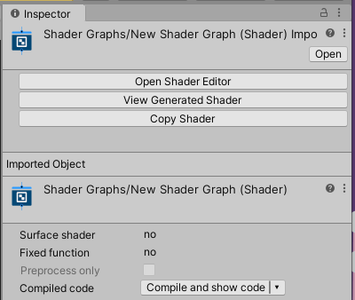
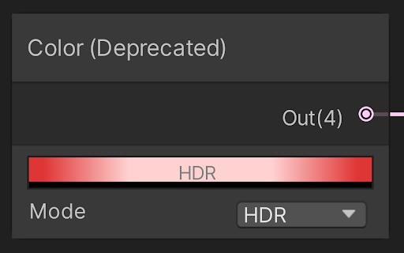
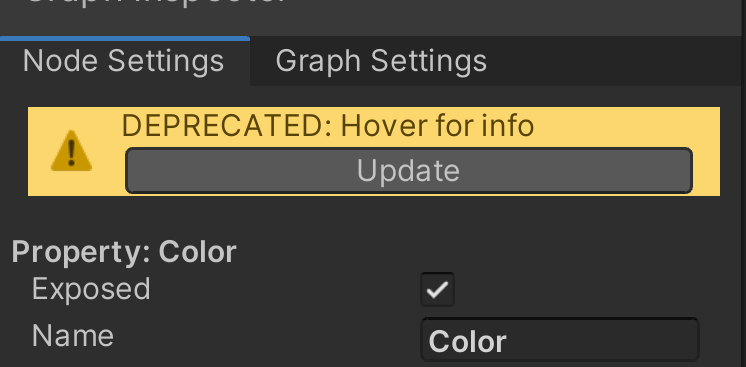

# Upgrade to version 10.0.x of Shader Graph

## Renamed Vector 1 property and Float precision

Shader Graph has renamed the **Vector 1** property as **Float** in both the Vector 1 node and the exposed parameter list. The **Float** precision was also renamed as **Single**. Behavior is exactly the same, and only the names have changed.

## Renamed Sample Cubemap Node

Shader Graph has renamed the previous Sample Cubemap Node to [Sample Reflected Cubemap Node](Sample-Reflected-Cubemap-Node.md), and has added a new [Sample Cubemap Node](Sample-Cubemap-Node.md), which uses world space direction.

## Master Stack graph output

Shader Graph has removed the Master Nodes and introduced a more flexible [Master Stack](Master-Stack.md) solution for defining graph output in 10.0. You can still open all graphs created in previous versions, because Shader Graph automatically upgrades them. This page describes the expected behavior and explains when you might need to perform manual upgrade steps.
<a name="AutomaticUpgrade"></a>

## Automatic upgrade from Master Nodes

### Upgrade one Master Node to the Master Stack

If your graph only has one Master Node, Shader Graph automatically upgrades all of the data from that Master Node to a Master Stack output, as described in this section.

Shader Graph automatically adds the correct [Targets](Graph-Target.md) to the [**Graph Settings**](Graph-Settings-Menu.md) tab of the [**Graph Inspector**](Internal-Inspector.md). It also copies all settings from the Master Node settings menu (gear icon) that describe surface options from the Master Node to the **Target Settings**.

Shader Graph then adds a [Block](Block-Node.md) node for each port on the Master Node to the Master Stack. It connects any nodes that you connected to the Master Node ports to the corresponding Block node. Also, Shader Graph copies any values that you entered into the default value inputs of the Master Node ports to the corresponding Block node.

After this upgrade process, the final shader is identical in appearance.

### Upgrade multiple Master Nodes to the Master Stack

If your graph has more than one Master Node, Shader Graph applies the above process for automatically upgrading one Master Node to the currently selected Active Master Node.

When you upgrade to the Master Stack format, Shader Graph removes any inactive Master Nodes from your graph, and you might lose this data. If you plan to upgrade a graph with multiple Master Nodes, it's best practice to keep a record of the ports, connected nodes, and any non-default settings in the settings menu (gear icon) of inactive Master Nodes.

After the upgrade, you can add any required Block nodes that went missing, and reconnect the nodes to the Master Stack. You also need to go to the **Graph Inspector** > **Graph Settings** tab > settings menu (gear icon), and manually enter the settings for inactive Master Nodes in the corresponding Target Setting.

### Upgrade cross-pipeline Master Nodes to the Master Stack

If your graph contains PBR or Unlit Master Nodes that are compatible with both the [Universal Render Pipeline](https://docs.unity3d.com/Packages/com.unity.render-pipelines.universal@latest) (URP) and the [High Definition Render Pipeline](https://docs.unity3d.com/Packages/com.unity.render-pipelines.high-definition@latest) (HDRP), Shader Graph automatically upgrades them to the Master Stack based on the render pipeline currently available in your project. With Master Stacks, when you switch from one render pipeline to another, you must reimport your Shader Graph assets to update the Material Inspector for any Materials in your project.

In URP, you can now find all PBR Master Node settings in the URP Lit Target. The Unlit Master Node settings are in the URP Unlit Target. These settings are the same, and the final shader should appear the same as before the upgrade.

In HDRP, settings from the PBR and Unlit Master Nodes are not the same as the HDRP Lit and Unlit Targets. Thus, there might be unexpected behavior when you upgrade PBR or Unlit Master Nodes to HDRP Lit and Unlit Master Stacks. The final shader might not appear the same as before the upgrade. When this happens, you can use the **Bug Reporter** to submit your upgrade issue, but keep in mind that some upgrade paths don't have immediate automated solutions and will require manual adjustments.

### "View Generated Shader" has moved

Previously, you could right-click the Master Node to bring up a context menu, and select **View Generated Shader** to preview the generated shader. In 10.0, you must now use the Unity Inspector, and click the **View Generated Shader** button on the Shader Graph asset.



## Settings in Graph Inspector

Shader Graph introduced an internal [Graph Inspector](Internal-Inspector.md) in version 10.0. The Graph Inspector is a floating window that displays settings related to objects you select in the graph.

### Graph settings

Graph-wide settings are now available only in the Graph Inspector's **Graph Settings** tab. Most notably, you can now go to the **Graph Settings** tab to access the **Precision** toggle, which was previously located on the Shader Graph Toolbar. There were no changes to data, and things like the **Precision** setting of the graph remain the same.

In the **Graph Settings** tab, you can also find settings that describe surface options for each Target, which were previously located in the Master Node cog menu. For more information about how Shader Graph automatically upgrades this data, see [Automatic upgrade from Master Nodes](#AutomaticUpgrade) above.

### Property settings

Property settings that were previously in Blackboard foldouts are now available in the Graph Inspector. You can now select multiple properties from the Blackboard and edit them all at the same time. There were no changes to data, and all settings you made on properties of the graph remain the same.

### Per-Node settings

All per-node settings that you previously managed by opening a settings (gear icon) sub-menu are now accessible through the Graph Inspector. There were no changes to data, and all settings you previously set on nodes, such as precision settings and Custom Function Node settings, remain the same.

Any settings on the Master Node that define surface options are now located in the Graph Inspector’s Graph Settings tab. For more information, see [Automatic upgrade from Master Nodes](#AutomaticUpgrade) above.

## Custom Function Nodes and Shader Graph Preview

To avoid errors in the preview shader compilation for Custom Function Nodes, you might need to use keywords for the in-graph preview rendering.

If you have any Custom Function Nodes with custom Shader Graph Preview code that uses `#if SHADERGAPH_PREVIEW`, you need to upgrade it to an `#ifdef` declaration, as follows.

```
#ifdef SHADERGAPH_PREVIEW
    Out = 1;
#else
    Out = MainLight;
#endif
```

## Deprecated node and property behaviors

Previously, some nodes and properties such as the [Color Node](Color-Node.md) didn't behave as intended, but they now work correctly in Shader Graph version 10.0. Older graphs that rely on the incorrect behavior still function the same as before, and you can choose to individually upgrade any deprecated nodes and properties. If you don't enable **Allow Deprecated Behaviors** in [Shader Graph Preferences](Shader-Graph-Preferences.md), newly-created nodes and properties use the latest version node and property behaviors.

For deprecated nodes, **(Deprecated)** appears after the node title in the main graph view.



For deprecated properties, **(Deprecated)** appears after the property name in the [Blackboard](Blackboard.md).


When you select a deprecated node or property, a warning appears in the [Internal Inspector](Internal-Inspector.md) along with an **Update** button that allows you to upgrade the selection. You can use undo/redo to reverse this upgrade process.



If you enable **Allow Deprecated Behaviors** in [Shader Graph Preferences](Shader-Graph-Preferences.md), Shader Graph displays the version of the deprecated node or property, and doesn't display any warnings even though the **Update** button appears. You can also use the Blackboard or Searcher to create deprecated nodes and properties.
