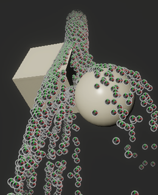

# Collide with Depth Buffer

Menu Path : **Collision > Collide with Depth Buffer**

The **Collide with Depth Buffer** Block makes particles collide with a specific Camera’s depth buffer. This is especially useful for fast moving particles like sparks or rain drops where precise collision is not as important.

**Important:** For the Block to generate depth collision, the specified Camera must be enabled.

## Block compatibility

This Block is compatible with the following Contexts:

- [Update](Context-Update.md)

## Block settings

| **Setting**           | **Type** | **Description**                                              |
| --------------------- | -------- | ------------------------------------------------------------ |
| **Camera**            | Enum     | The method to decide which Camera to use to calculate depth collision. The options are: &#8226; **Main**: Uses the main Camera in the Scene. This requires a Camera in the Scene to have the **MainCamera** tag. &#8226; **Custom**: Allows you to specify a particular Camera to use. |
| **Surface Thickness** | Enum     | The method to decide how to specify the thickness of the colliding surface. The options are: &#8226; **Infinite**: Sets the thickness of the colliding surface to be infinite. &#8226; **Custom**: Allows you to specify a particular thickness value. |
| **Radius Mode**       | Enum     | The mode that determines the collision radius of each particle. The options are: &#8226; **None**: Particles have a radius of zero. &#8226; **From Size**: Particles inherit their radius from their individual sizes. &#8226; **Custom**: Allows you to set the radius of the particles to a specific value. |
| **Rough Surface**     | Bool     | Toggles whether or not the collider simulates a rough surface. When enabled, Unity adds randomness to the direction in which particles bounce back to simulate collision with a rough surface. |

## Block properties

| **Input**             | **Type** | **Description**                                              |
| --------------------- | -------- | ------------------------------------------------------------ |
| **Bounce**            | Float    | The amount of bounce to apply to particles after a collision. A value of 0 means the particles do not bounce. A value of 1 means particles bounce away with the same speed they impacted with. |
| **Friction**          | Float    | The speed that particles lose during collision. The minimum value is 0. |
| **Lifetime Loss**     | Float    | The proportion of life a particle loses after collision.     |
| **Roughness**         | Float    | The amount to randomly adjust the direction of a particle after it collides with the surface. This property only appears when you enable **Rough Surface**. |
| **Radius**            | Float    | The radius of the particle this Block uses for collision detection. This property only appears when **Radius Mode** is set to **Custom**. |
| **Camera**            | Camera   | The Camera to use for generating the collision surface. This Block uses the depth buffer from this Camera to generate the collision surface. This property only appears when **Camera** is set to **Custom**. |
| **Surface Thickness** | Float    | The thickness of the collision surface.  This property only appears when **Surface Thickness** is set to **Custom**. |

## Limitations
When using the Opaque blend mode, particles write to the depth buffer. In this scenario, this block will make the particles collide with their own depth, leading to an unstable behavior.
