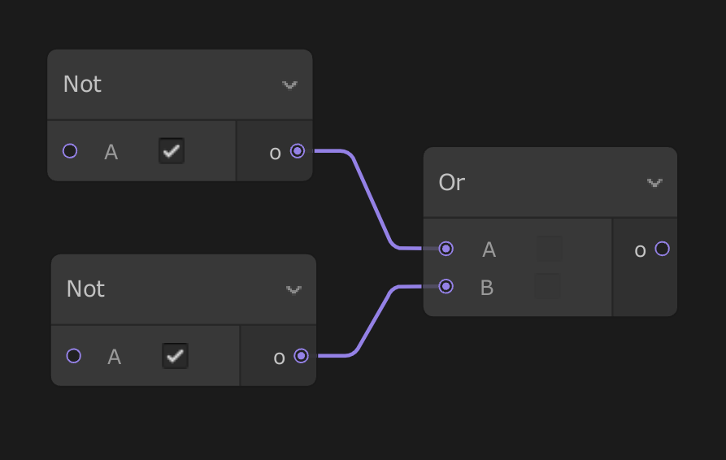

# Nor (Logic)

Menu Path : **Operator > Logic > Nor**

The **Nor** Operator takes two inputs and outputs the result of a logical *nor* operation between them. *Nor* is a composite operation that first calculates the *not* of the inputs and then calculates the *or* of the results. The result of A **Nor** B is `true` if either A or B is `false`. This operator is equivalent to the C# `!` operator followed by the `||` operator.

## Operator properties

| **Input** | **Type** | **Description**                                             |
| --------- | -------- | ----------------------------------------------------------- |
| **A**     | bool     | The left operand. If this is `false` then **o** is `true`.  |
| **B**     | bool     | The right operand. If this is `false` then **o** is `true`. |

| **Output** | **Type** | **Description**                                              |
| ---------- | -------- | ------------------------------------------------------------ |
| **o**      | bool     | If **A** or **B** is `false`, this value is `true`. Otherwise, if both **A** and **B** are `true` this value is `false`. |

## Details

This Operator provides the same result as the following graph :

