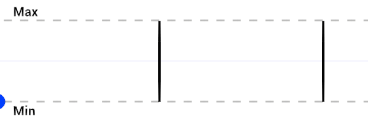

# Sawtooth Wave

Menu Path : **Operator > Math > Wave > Sawtooth Wave**

The **Sawtooth Wave** Operator evaluates an input to generate a value which linearly increases from a minimum to a maximum value. When the output value reaches the maximum, it resets to the minimum value.

If you set **Frequency** to **1**, the output value goes from **Min** to **Max** as the **Input** changes from **0** to almost **1**. When **Input** reaches **1**, the output value goes back to **Min** and starts the cycle again.

You can use this Operator to gradually move between two values and reset the value at the end. If you set **Min** to **0** and **Max** to **1**, you can use this alongside the [Lerp](Operator-Lerp.md) Operator to interpolate between any two values, like positions or colors.

## Operator properties

| **Input**     | **Type**                                | **Description**                                              |
| ------------- | --------------------------------------- | ------------------------------------------------------------ |
| **Input**     | [Configurable](#operator-configuration) | The value this Operator evaluates to generate the output value. |
| **Frequency** | [Configurable](#operator-configuration) | The rate at which the **Input** value moves between **Min** and **Max**. Larger values make the wave repeat itself more. |
| **Min**       | [Configurable](#operator-configuration) | The minimum value that **Out** can be.                       |
| **Max**       | [Configurable](#operator-configuration) | The maximum value that **Out** can be.                       |
| **Out**       | Matches **Input**                       | The value this Operator generates between **Min** and **Max** based the **Input** and **Frequency**. |

| **Output** | **Type**          | **Description**                                              |
| ---------- | ----------------- | ------------------------------------------------------------ |
| **Out**    | Matches **Input** | The value this Operator generates between **Min** and **Max** based the **Input** and **Frequency**. |

## Operator configuration

To view the Operator's configuration, click the **cog** icon in the Operator's header.

| **Property**  | **Description**                                              |
| ------------- | ------------------------------------------------------------ |
| **Input**     | The value type for the **Input** port. For the list of types this property supports, see [Available types](#available-types). |
| **Frequency** | The value type for the **Frequency** port. For the list of types this property supports, see [Available types](#available-types). |
| **Min**       | The value type for the **Min** port. For the list of types this property supports, see [Available types](#available-types). |
| **Max**       | The value type for the **Max** Port. For the list of types this property supports, see [Available types](#available-types). |

### Available types

You can use the following types for your **Input**, **Min**, and **Max** ports:

- **float**
- **Vector**
- **Vector2**
- **Vector3**
- **Vector4**
- **Position**
- **Direction**
