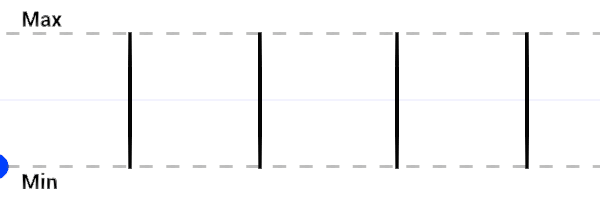

# Square Wave

Menu Path : **Operator > Math > Wave > Square Wave**

The Square Wave Operator allows you to generate a value which alternates between a minimum and a maximum value at steady intervals based on a provided input and a set frequency.

If **Frequency** is set to 1, the blue dot remains at **Min** with an **Input** value from 0 to almost 0.5. Then, with an **Input** value from 0.5 to almost 1, the dot remains at **Max**. After that, the wave repeats.

You can use this Operator to instantaneously switch between two values at a steady rate. This can be useful if you want to periodically toggle a behavior on and off. For example, if you want to apply a force at steady intervals.

## Operator properties

| **Input**     | **Type**                                | **Description**                                              |
| ------------- | --------------------------------------- | ------------------------------------------------------------ |
| **Input**     | [Configurable](#operator-configuration)     | The value this Operator evaluates to generate the output value. |
| **Frequency** | [Configurable](#operator-configuration)     | The rate at which the **Input** value switches between **Min** and **Max**. Larger values make the wave repeat itself more. |
| **Min**       | [Configurable](#operator-configuration)     | The minimum value that **Out** can be.                       |
| **Max**       | [Configurable](#operator-configuration) | The maximum value that **Out** can be.                       |

| **Output** | **Type**          | **Description**                                              |
| ---------- | ----------------- | ------------------------------------------------------------ |
| **Out**    | Matches **Input** | The value this Operator generates between **Min** and **Max** based the **Input** and **Frequency**. |

## Operator configuration

To view the Operator's configuration, click the **cog** icon in the Operator's header.

| **Property**  | **Description**                                              |
| ------------- | ------------------------------------------------------------ |
| **Input**     | The value type for the **Input** port. For the list of types this property supports, see [Available types](#available-types). |
| **Frequency** | The value type for the **Frequency** port. For the list of types this property supports, see [Available types](#available-types). |
| **Min**       | The value type for the **Min** port. For the list of types this property supports, see [Available types](#available-types). |
| **Max**       | The value type for the **Max** Port. For the list of types this property supports, see [Available types](#available-types). |

### Available types

You can use the following types for your **Input**, **Min**, and **Max** ports:

- **float**
- **Vector**
- **Vector2**
- **Vector3**
- **Vector4**
- **Position**
- **Direction**
