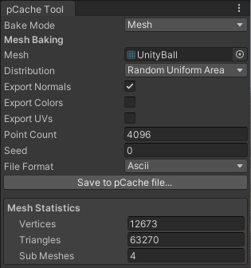
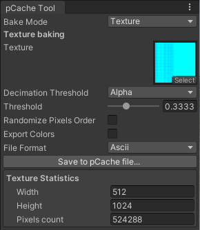

# Point Cache Bake Tool

The Point Cache Bake Tool is a utility that enables you to bake Point Caches to use in visual effects that rely on complex geometry. The tool takes an input [Mesh](https://docs.unity3d.com/Manual/class-Mesh.html) or [Texture2D ](https://docs.unity3d.com/ScriptReference/Texture2D.html)and generates a [Point Cache asset](point-cache-asset.md) representation of it which you can use in a visual effect.

For information on what Point Caches are and what you can use them for, see [Point Caches in the Visual Effect Graph](point-cache-in-vfx-graph.md).

The Point Cache Bake Tool uses a window interface that specifies the input Mesh/Texture2D as well as various properties that control the output Point Cache. To open the Point Cache Bake Tool window, click **Window > Visual Effects > Utilities > Point CacheBake Tool**.

## Working with the Point Cache Bake Tool window

The Point Cache Bake Tool has two bake modes:

- **Mesh**: Bakes a Point Cache from an input Mesh asset.
- **Texture**: Bakes a Point Cache from an input Texture2D asset.

Depending on which mode you select, the window displays different properties to control the baking process. After you specify the input Mesh/Texture2D and set up the properties, click **Save to pCache file…** to bake the Point Cache and save the result to a Point Cache asset.

## Properties

### Common

These properties appear in the Inspector regardless of the **Bake Mode** you select.

| **Property**    | **Description**                                              |
| --------------- | ------------------------------------------------------------ |
| **Bake Mode**   | Specifies the type of input to bake a Point Cache from. The options are: &#8226; **Mesh**: Bakes a Point Cache from an input Mesh asset. &#8226; **Texture**: Bakes a Point Cache from an input Texture2D asset. |
| **Seed**        | The random seed to use for Point Cache generation.           |
| **File Format** | Specifies the format to encode the Point Cache with. The options are: &#8226; **Ascii**: Uses Ascii encoding. &#8226; **Binary**: Uses binary encoding. |

### Mesh Baking

This section only appears if you set **Bake Mode** to **Mesh**.

 *Point Cache Bake Tool's Mesh Baking section in the Inspector.*

| **Property**       | **Description**                                              |
| ------------------ | ------------------------------------------------------------ |
| **Mesh**           | The Mesh to produce a Point Cache representation of.         |
| **Distribution**   | Specifies the point scattering technique the Point Cache Bake Tool uses to sample the input Mesh. The options are:  &#8226; **Sequential**: Creates a point at each triangle/vertex sequentially. &#8226; **Random**: Creates a point at each triangle/vertex randomly. If **Bake Mode** is set to **Triangle**, this option does not take the area of the triangle into account. &#8226; **Random Uniform Area**: Creates a point at each triangle randomly. This option takes the area of the triangle into account. |
| **Bake Mode**      | Specifies how to bake the Mesh. The options are:  &#8226; **Vertex**: Bakes the Mesh on a per-vertex basis. &#8226; **Triangle**: Bakes the Mesh on a per-triangle basis.  This property only appears if you set **Distribution** to **Sequential** or **Random**. If you set **Distribution** to **Random Uniform Area**, this property disappears and uses **Triangle** implicitly. |
| **Export Normals** | Indicates whether to export vertex normal data to the Point Cache. |
| **Export Colors**  | Indicates whether to export vertex color data to the Point Cache. |
| **Exports UVs**    | Indicates whether to export vertex UV data to the Point Cache. |
| **Point Count**    | The number of points to create for the Point Cache.          |
| **Seed**           | See [Common](#common).                                       |
| **File Format**    | See [Common](#common).                                       |

#### Mesh Statistics

This section of the window only appears if you assign a Mesh asset to the **Mesh** property. It contains information about the input Mesh.

| **Statistic**  | **Description**                                   |
| -------------- | ------------------------------------------------- |
| **Vertices**   | The number of vertices the input Mesh contains.   |
| **Triangles**  | The number of triangles the input Mesh contains.  |
| **Sub Meshes** | The number of sub-meshes the input Mesh contains. |

### Texture Baking

This section only appears if you set **Bake Mode** to **Texture**.

 *Point Cache Bake Tool's Texture Baking section in the Inspector.*

| **Property**               | **Description**                                              |
| -------------------------- | ------------------------------------------------------------ |
| **Texture**                | The Texture2D to produce a Point Cache representation of.    |
| **Decimation Threshold**   | Specifies the method that selects which of the Texture2D's pixels to ignore during the baking process. The options are: &#8226; **None**: Does not ignore any pixels. &#8226; **Alpha**: Uses the alpha channel. &#8226; **Luminance**: Uses the luminance of the combined RGB channels. &#8226; **R**: Uses the red channel. &#8226; **G**: Uses the green channel. &#8226; **B**: Uses the blue channel. |
| **Threshold**              | The threshold that determines which pixels to ignore during the baking process. The Point Cache Bake Tool ignores pixels with a value lower than this. This property only appears if you set **Decimation Threshold** to a value other than **None**. |
| **Randomize Pixels Order** | Indicates whether to randomize points instead of sorting them by pixel row/column. |
| **Seed**                   | See [Common](#common). This property only appears if you enable **Randomize Pixels Order**. |
| **Export Colors**          | Indicates whether to export the Texture's color data to the Point Cache. |
| **File Format**            | See [Common](#common).                                       |

#### Texture Statistics

This section of the window only appears if you assign a Texture2D asset to the **Texture** property. It contains information about the input Texture.

| **Statistic**    | **Description**                                              |
| ---------------- | ------------------------------------------------------------ |
| **Width**        | The width of the input Texture2D in pixels.                  |
| **Height**       | The height of the input Texture2D in pixels.                 |
| **Pixels Count** | The total number of pixels the input Texture2D contains. This is equal to the width of the Texture2D multiplied by the height of the Texture2D. |
