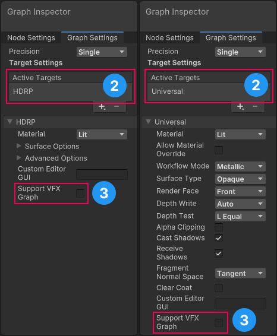
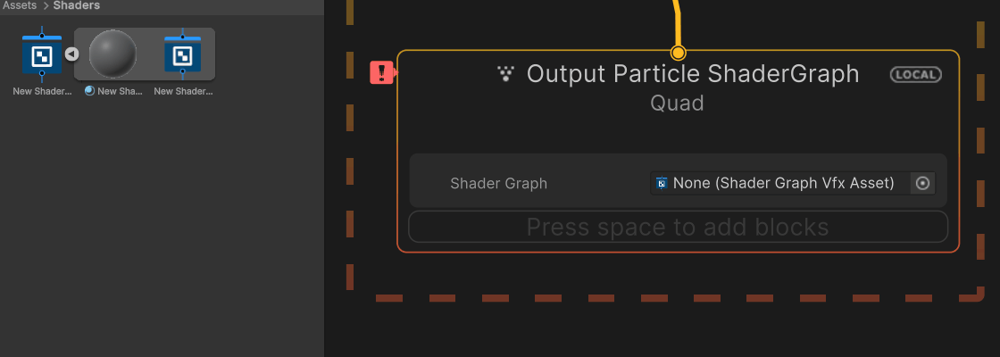

# Working with Shader Graph in the Visual Effect Graph

Visual Effect Graphs (VFX Graphs) can use compatible Shader Graphs to render particles. This enables you to build custom shaders to use in visual effects. This document explains:

- [How to make a Shader Graph compatible with Visual Effect Graphs](#make-shader-graph-compatible)
- [How to set up a Visual Effect Graph to use a Shader Graph to render particles](#use-shader-graph-in-vfx)
- [How to upgrade an existing project](#upgrade-your-project)
- [Known limitations of the Visual Effect Graph](#known-limitations)

## Make a Shader Graph compatible with a Visual Effect Graph

To make a Shader Graph compatible with the Visual Effect Graph:

1. Open a shader in the [Shader Graph window](https://docs.unity3d.com/Packages/com.unity.shadergraph@latest?subfolder=/manual/index.html).
2. In the [Graph Settings tab](https://docs.unity3d.com/Packages/com.unity.shadergraph@latest?subfolder=/manual/Graph-Settings-Tab.html), specify the render pipeline [Target](https://docs.unity3d.com/Packages/com.unity.shadergraph@latest?subfolder=/manual/Graph-Target.html) (**HDRP** or **Universal**).
3. Enable **Support VFX Graph**.

A Shader Graph shader that is compatible with the Visual Effect Graph can also work as a regular shader. Most HDRP and URP Shader Graph shaders support the Visual Effect Graph. For exceptions, see [Known Limitations](#known-limitations).

**Note**: VFX Graph support does not impact runtime performance but Shader Graphs which use **Support VFX Graph** take longer to compile.

## Upgrade your project

Unity versions **2021.2**, and earlier use the deprecated **Visual Effect** Target to integrate Shader Graphs with Visual Effect Graphs.

The **Visual Effect** Target  limits functionality and requires you to use the following:

- Dedicated VFX shaders
- The [Metallic](https://docs.unity3d.com/Manual/StandardShaderMetallicVsSpecular.html) workflow

To upgrade a project to use the new render pipeline Target:

1. In the [Graph Settings tab](https://docs.unity3d.com/Packages/com.unity.shadergraph@latest?subfolder=/manual/Graph-Settings-Tab.html) of the shader add a **HDRP** or **Universal** Target.
2. Enable **Support VFX Graph**.
3. Remove the **Visual Effect** Target.

## Shader Graph in a Visual Effect Graph

To make a visual effect with Shader Graph:

1. Open your Visual Effect Graph in the Visual Effect Graph window. If you do not have a Visual Effect Graph, go to **Create** > **Visual Effects** > **Visual Effect Graph** to create a new one.
2. In the interface for output contexts, assign your compatible Shader Graph to the **Shader Graph** property on . To do this, either search for the Shader Graph directly in the Asset Picker, or drag the Shader Graph sub-asset to the **Shader Graph** slot (**Note**: Shader Graphs only appear in VFX Asset Picker search results if they have **Support VFX Graph** enabled):

3. Click on the output Context to view it in the Inspector.

You can make changes to the Shader Graph's Surface Options in the output context.

**Note**: Any edits you make to a Shader Graph's exposed properties or material settings via the VFX Graph Inspector are local to the VFX Graph, and do not affect the Shader Graph asset.

### Visual Effect Graph output compatibility

The following output contexts support Shader Graphs:

- [Particle Shader Graph Mesh](Context-OutputShaderGraphMesh.md)

- [Particle Shader Graph Primitive](Context-OutputShaderGraphPlanarPrimitive.md) (including Particle Shader Graph Quad, Particle Shader Graph Triangle, Particle Shader Graph  Octagon)

- [ParticleStrip Shader Graph Quad](Context-OutputShaderGraphStrip.md) (including Particle Lit Strip Quad)

  

## Known limitations

### Keywords

Exposed Keywords from the Shader Graph can be used within VFX Graph.

When a corresponding slot is constant in VFX, a MultiCompile keyword will be stripped out by the Shader Generation to prevent the shader variant explosion.

A keyword defined as ShaderFeature in Shader Graph is only valid if the slot in VFX is not connected to a dynamic expression, if dynamic switching of a keyword is needed, the keyword must be defined as MultiCompile.

Non exposed global keyword are not exposed in VFX but the switch is functional using scripting API (see [Shader.EnableKeyword](https://docs.unity3d.com/ScriptReference/Shader.EnableKeyword.html)).

### Known limitations

Visual Effect Graph does not support the following type of Shader Graph [Blackboard](https://docs.unity3d.com/Packages/com.unity.shadergraph@latest?subfolder=/manual/Blackboard.html) exposed properties:

- [Diffusion Profile](https://docs.unity3d.com/Packages/com.unity.shadergraph@latest?subfolder=/manual/Diffusion-Profile-Node.html)
- [Virtual Texture](https://docs.unity3d.com/Manual/svt-use-in-shader-graph.html)
- [Gradient](https://docs.unity3d.com/Packages/com.unity.shadergraph@latest?subfolder=/manual/Gradient-Node.html)

Shader Graph does not support some features in specific Targets.

- The HDRP Target does not support the following:
  - [Decal Shader Graph](https://docs.unity3d.com/Packages/com.unity.render-pipelines.high-definition@latest?subfolder=/manual/decal-master-stack-reference.html).
  - [Fog Volume Shader Graph](https://docs.unity3d.com/Packages/com.unity.render-pipelines.high-definition@latest?subfolder=/manual/fog-volume-master-stack-reference.html)
  - [Motion vectors](https://docs.unity3d.com/Packages/com.unity.render-pipelines.high-definition@latest?subfolder=/manual/Motion-Vectors.html) for vertex animation.
- The URP does not support the following:
  - [Decal Shader Graph](https://docs.unity3d.com/Packages/com.unity.render-pipelines.universal@latest?subfolder=/manual/decal-shader.html.
- The Visual Effect Target (deprecated) does not support:
  - HDRP or Universal material types.
  - Access to the shader's Vertex stage.
