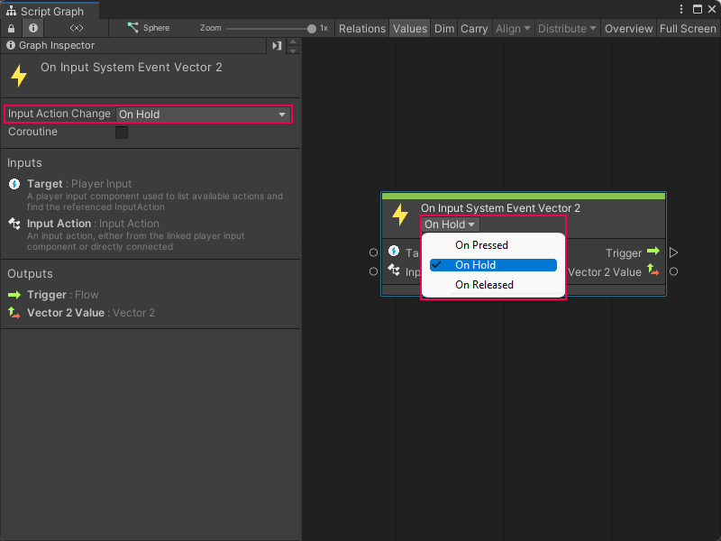

# Capture input with the Input System package

> [!IMPORTANT]
> If you don't complete the prerequisite configuration for your project, you can't use the Input System package with Visual Scripting. For more information, see [Input System package prerequisites](vs-capture-player-input.md#input-system-package-prerequisites).

To use the Input System package with Visual Scripting to capture input in your project: 

1. [Open](vs-open-graph-edit.md) or [create](vs-create-graph.md) a Script Graph attached to the GameObject that you want your users to move. 

2. [!include[vs-open-fuzzy-finder](./snippets/vs-open-fuzzy-finder.md)]

3. Go to **Events** &gt; **Input** or search for **On Input System Event**.

4. Select an Input System Event node. In this example, select the **On Input System Event Vector 2** node to add it to the graph. 

5. Set the **On Input System Event Vector 2** node's **Input Action Change Type** control to **On Hold**:

    

6. In the **Input Action** list on the **On Input System Event Vector 2** node, select an Input Action to trigger the node. In this example, select **Move**. 

    > [!NOTE]
    > By default, Visual Scripting displays all Input Actions from the Input Action asset attached to your current GameObject's Player Input component. 

7. [!include[vs-open-fuzzy-finder](./snippets/vs-open-fuzzy-finder.md)]

   > [!TIP]
   > If a context menu appears when you right-click, select **Add Node** to open the fuzzy finder.

8. Go to **Codebase** &gt; **Unity Engine** &gt; **Vector 3** or search for **Vector 3 Get X**. 

9. Select **Get X** to add the **Vector 3 Get X** node to the graph.  

10. [!include[vs-open-fuzzy-finder](./snippets/vs-open-fuzzy-finder.md)]

11. Go to **Codebase** &gt; **Unity Engine** &gt; **Vector 3** or search for **Vector 3 Get Z**. 
    
12. Select **Get Z** to add the **Vector 3 Get Z** node to the graph. 

13. Select the **Vector 2 Value** output port on the **On Input System Event Vector 2** node. 
 
14. [Make a connection](vs-creating-connections.md) to the **Target** input port on the **Vector 3 Get X** node:

    

15. Select the **Vector 2 Value** output port. 
 
16. [Make a connection](vs-creating-connections.md) to the **Target** port on the **Vector 3 Get Z** node. 

17. [!include[vs-open-fuzzy-finder](./snippets/vs-open-fuzzy-finder.md)] 

18. Go to **Codebase** &gt; **Unity Engine** &gt; **Transform** or search for **Translate**. 

19. Select **Transform: Translate (X, Y, Z)** to add the Translate node to the graph. 

20. Select the **Value: Float** output port on the **Vector 3 Get X** node. 
  
21. [Make a connection](vs-creating-connections.md) to the **X** float input port on the **Translate** node. 

22. Select the **Value: Float** output port on the **Vector 3 Get X** node. 

23. [Make a connection](vs-creating-connections.md) to the **Z** float input port on the **Translate** node. 

    The finished graph looks similar to the following image: 

    ![An image of the Graph window, that displays the final result of a simple input capture graph with the Input System package. An On Input System Event Vector 2 node connects its output trigger port to the input trigger port on a Transform Translate node. The On Input System Event Vector 2 node's Vector 2 output port connects to the Vector 3 input on a Vector 3 Get X node and a Vector 3 Get Z node. The Vector 3 Get X node connects its Float result port to the X input port on the Translate node. The Vector 3 Get Z node connects its Float result port to the Z input port on the Translate node.](images/vs-input-new-system-example.png)

24. To enter Play mode, select **Play** from [the Unity Editor's Toolbar](https://docs.unity3d.com/Manual/Toolbar.html). 

25. While in the [Game view](https://docs.unity3d.com/Manual/GameView.html), press a key defined under the Input Actions asset for **Move** in the **Player** Action Map. 

    
The GameObject moves along the X or Z axis in the Game view, based on the key pressed and the Input Actions asset. 

For more information on how to define Input Actions, see [Input Action Assets](https://docs.unity3d.com/Packages/com.unity.inputsystem@latest/index.html?subfolder=/manual/ActionAssets.html) in the Input System package documentation.

## Additional resources

- [Capture user input in an application](vs-capture-player-input.md)
- [Add and configure a Player Input component](vs-capture-player-input-add-component.md)
- [On Input System Event Button node](vs-nodes-events-input-system-button.md)
- [On Input System Event Float node](vs-nodes-events-input-system-float.md)
- [On Input System Event Vector 2 node](vs-nodes-events-input-system-vector2.md)

