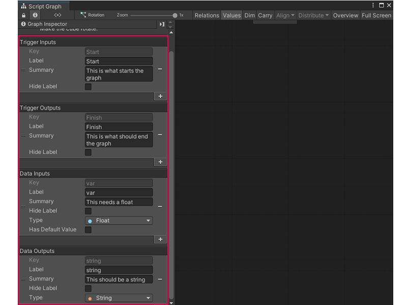

# Add a Trigger or Data port to a Script Graph

A Script Graph used as a Subgraph can receive data and logic from its parent graph. Add and define ports on a graph to choose what data graphs can send and receive. 

For more information about Subgraphs, see [Subgraphs and State Units](vs-nesting-subgraphs-state-units.md).

## Add ports from a graph

To add a Trigger Input, Trigger Output, Data Input, or Data Output port to a Script Graph:

<ol>
<li>
<a href="vs-open-graph-edit.md">Open the Script Graph</a> you want to edit in the Graph window.
</li>
<li>
With no nodes or groups selected in the graph, open the <a href="vs-interface-overview.md#the-graph-inspector">Graph Inspector</a>.
</li>
<li>
Select <strong>Add</strong> (+) under the port type you want to add:

<ul>
    <li>
<strong>Trigger Inputs</strong>
</li>
    <li>
<strong>Trigger Outputs</strong>
</li>
    <li>
<strong>Data Inputs</strong>
</li>
    <li>
<strong>Data Outputs</strong>
</li>
</ul></li>
<li>
In the <strong>Key</strong> field, enter a unique key name for the port. The Key value can't match the Key of any existing ports on the current Script Graph.
</li>
    
<h5>NOTE</h5>
If two <strong>Key</strong> values are the same on the same graph, Visual Scripting ignores the second port definition and displays a warning in the Graph Inspector. If you change the <strong>Key</strong> value for a port after you've made a connection to that port in a graph, the connections break and you must reconnect them.

<li>
In the <strong>Label</strong> field, enter a label to display for the port. The label displays on the Subgraph node and its Input or Output node.
</li>
    
<h5>NOTE</h5>
If you don't set a <strong>Label</strong>, Visual Scripting uses the value from the <strong>Key</strong> field.

<li>
In the <strong>Summary</strong> field, enter a brief summary of the port to display in the Graph Inspector when you select the Subgraph node, Input node, or Output node.
</li>
<li>
Toggle <strong>Hide Label</strong> to do the following:

<ul>
    <li>
Enable <strong>Hide Label</strong> to hide the port label on any Subgraph node, Input node, or Output node.
</li> 
    <li>
Disable <strong>Hide Label</strong> to display the data from the <strong>Label</strong> field.
</li>
</ul></li>
<li>
(Data Inputs and Data Outputs Only) Set a data type for the port:

<ol type="a">
    <li>
Select the <strong>Type</strong> list to open the Type menu.
</li>
    <li>
Select a data type from the list to set the data type the port accepts.
</li>
</ol>
</li>
<li>
(Data Inputs Only) Enable <strong>Has Default Value</strong> to display the <strong>Default Value</strong> field. Disable <strong>Has Default Value</strong> to hide the <strong>Default Value</strong> field.

<ol type="a">
    <li>
In the <strong>Default Value</strong> field, enter the default value the port uses if it doesn't receive a data input while the Script Graph runs.
</li>
</ol>
</li>
</ol>

## Add ports with Input and Output nodes

You can also use an [Input node](vs-nesting-input-node.md) or an [Output node](vs-nesting-output-node.md) to define ports on a Script Graph:

<ol>
<li>
<a href="vs-open-graph-edit.md">Open the Script Graph</a> you want to edit in the Graph window.
</li>
<li>
[!include[vs-open-fuzzy-finder](./snippets/vs-open-fuzzy-finder.md)]
</li>
<li>
Go to <strong>Nesting</strong>.
</li> 
<li>
Do one of the following:

    <ul>
        <li>
To add a Trigger Input or Data Input port to the graph, select <strong>Input</strong>.
</li>
        <li>
To add a Trigger Output or Data Output port to the graph, select <strong>Output</strong>.
</li>
    </ul>
</li>
<li>
Select the new Input or Output node in the graph.
</li>
<li>
Open the <a href="vs-interface-overview.md#the-graph-inspector">Graph Inspector</a>.
</li>
<li>
In the <strong>Key</strong> field, enter a unique key name for the port. The Key value can't match the Key of any existing ports on the current Script Graph.
</li>
    
<h5>NOTE</h5>
If two <strong>Key</strong> values are the same on the same graph, Visual Scripting ignores the second port definition and displays a warning in the Graph Inspector. If you change the <strong>Key</strong> value for a port after you've made a connection to that port in a graph, the connections break and you must reconnect them.

<li>
In the <strong>Label</strong> field, enter a label to display for the port. The label displays on the Subgraph node and its Input or Output node.
</li>
    
<h5>NOTE</h5>
If you don't set a <strong>Label</strong>, Visual Scripting uses the value from the <strong>Key</strong> field.

<li>
In the <strong>Summary</strong> field, enter a brief summary of the port to display in the Graph Inspector when you select the Subgraph node, Input node, or Output node.
</li>
<li>
Toggle <strong>Hide Label</strong> to do the following:

<ul>
    <li>
Enable <strong>Hide Label</strong> to hide the port label on any Subgraph node, Input node, or Output node.
</li> 
    <li>
Disable <strong>Hide Label</strong> to display the data from the <strong>Label</strong> field.
</li>
</ul></li>
<li>
(Data Inputs and Data Outputs Only) Set a data type for the port:

<ol type="a">
    <li>
Select the <strong>Type</strong> list to open the Type menu.
</li>
    <li>
Select a data type from the list to set the data type the port accepts.
</li>
</ol>
</li>
<li>
(Data Inputs Only) Enable <strong>Has Default Value</strong> to display the <strong>Default Value</strong> field. Disable <strong>Has Default Value</strong> to hide the <strong>Default Value</strong> field.

<ol type="a">
    <li>
In the <strong>Default Value</strong> field, enter the default value the port uses if it doesn't receive a data input while the Script Graph runs.
</li>
</ol>
</li>
</ol>

## Next steps

Add the Script Graph as a Subgraph in another Script Graph. For more information on how to add a Script Graph as a Subgraph, see [Add a Subgraph to a Script Graph](vs-nesting-add-subgraph.md). 

For more information on the port types on a Script Graph, see [Subgraph node](vs-nesting-subgraph-node.md). 

The defined Trigger and Data ports affect the ports on the Input and Output nodes in a Script Graph. For more information, see [Input node](vs-nesting-input-node.md) and [Output node](vs-nesting-output-node.md).